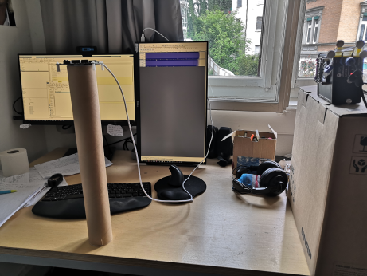
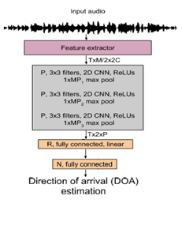
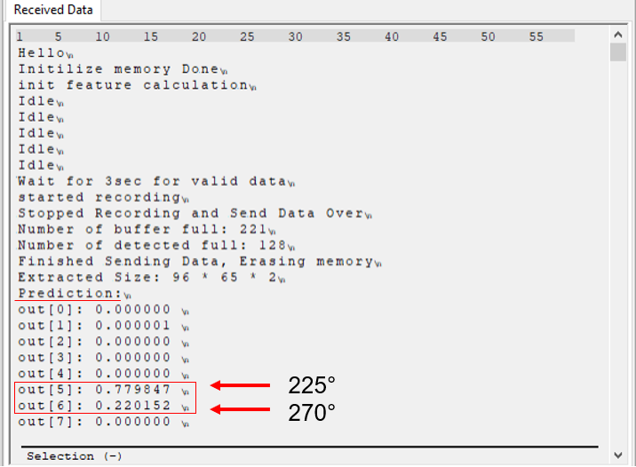

<!-- #######  Neural Networks for STM32L475 MicroConroller Implementation #########-->

<h1 style="color: #5e9ca0;">Neural Networks for STM32L475 Cortex-M4 Microcontroller</h1>
<h2 style="color: #2e6c80;">Implementation usable for Direction of Arrival (DoA) classification</h2>

&nbsp;

The firmware allows to classify the direction of arrival (DoA) of a spoken utterance by exploiting the sound reflection pattern of the microcontroller board and the surrounding area.
We trained for this task a tiny convolutional neural network (CNN). For training we used the CMU speech recording database convolved with measured impulse responses of the shown room for 45° steps in the horizontal plane. We provide pre-trained networks and IPython Code to train your own tinyML network.

The recording can be started on the B-L475E-IOT01A Discovery kit by pressing the USER button.
The user has then 3 seconds time to formulate the utterance. After it the DoA prediction is performed.
The network implementation consumes at prediction 18KB flash, 26KB Ram and 59mW power.
After perfoming the prediction the microcontroller prints the prediction probability for each of the 8 horizontal incidence angles over UART.

<strong>&nbsp;Source-Code folder structure: (/src/)</strong>

<ol style="list-style: none; font-size: 14px; line-height: 32px; font-weight: bold;">
<li style="clear: both;">"/AudioRecording" folder contains C-code to record audio (Sine-Sweeps in the project) from different angles for varying sample rates and send over UART. </li>
<li style="clear: both;">"/Matlab" folder contains Matlab-code for impulse response extraction of the sine-sweep recorded angles, convolving them with CMU speech database and saving .wav files of extracted features (Short-Time Fourier Transforms). </li>
<li style="clear: both;">"/PythonCode" folder contains Python and IPython Notebook code for neural network development, quantization, and verification. </li>
<li style="clear: both;">"/Firmware" folder contains final implemented classification C-code to predict the incident angle of sound. </li>
<li style="clear: both;">"/QmnFirmware" folder contains feature extraction and classification C-code based on Qmn format instead of floating-point as in the firmware. UNDER DEVELOPMENT </li>
</ol>

<strong>&nbsp;Generated reports folder structure: (/reports/)</strong>

<ol style="list-style: none; font-size: 14px; line-height: 32px; font-weight: bold;">
<li style="clear: both;">This folder contains reports of the verified neural network variations on the target on the verification dataset and comparison in an Excel format.</li>
</ol>
